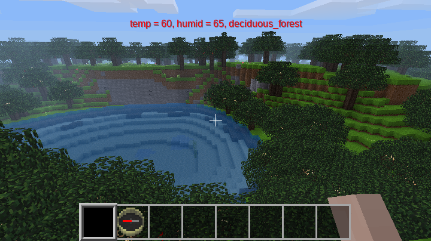

## Display Biome [display_biome]

Mod to place a HUD on screen with local temperature, humidity, and biome name.

**Updates:**

- Now defaults to not showing biome information.
- Use chat command /biomes to enable.
- Further invocations of /biomes will toggle biome information off and on.
- Enable state is stored using mod storage.

Performs simple ground search to try to be more accurate when flying with multi-elevation biomes.

No dependencies.

**License of source code:  LGPL-2.1**

This library is free software; you can redistribute it and/or modify it under the terms of the GNU Lesser General Public License as published by the Free Software Foundation; either version 2.1 of the License, or (at your option) any later version.

This library is distributed in the hope that it will be useful, but WITHOUT ANY WARRANTY; without even the implied warranty of MERCHANTABILITY or FITNESS FOR A PARTICULAR PURPOSE. See the GNU Lesser General Public License for more details.

You should have received a copy of the GNU Lesser General Public License along with this library; if not, write to the Free Software Foundation, Inc., 51 Franklin Street, Fifth Floor, Boston, MA 02110-1301 USA

**License of media (images):  CC-BY-SA-4.0**

This work is licensed under the Creative Commons Attribution-ShareAlike 4.0 International License. To view a copy of this license, visit http://creativecommons.org/licenses/by-sa/4.0/ or send a letter to Creative Commons, PO Box 1866, Mountain View, CA 94042, USA.